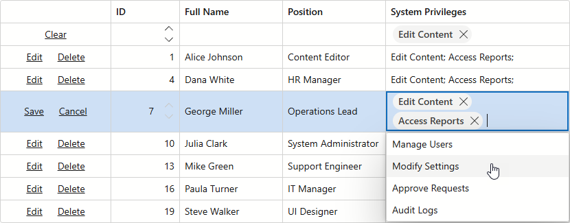

<!-- default badges list -->
[](https://supportcenter.devexpress.com/ticket/details/T1104359)
[](https://docs.devexpress.com/GeneralInformation/403183)
[](#does-this-example-address-your-development-requirementsobjectives)
<!-- default badges end -->
# Blazor Grid - Use TagBox as Column Editor

This example integrates our [TagBox](https://docs.devexpress.com/Blazor/DevExpress.Blazor.DxTagBox-2) editor into a column within the DevExpress Blazor Grid UI component. During editing operations, this TagBox allows you to assign multiple privileges to a user. In the filter row, the TagBox filters data by multiple privileges.



## Implementation Details

Our Blazor Grid does not generate TagBox editors for data columns. You can use templates to display TagBoxes in edited/filter row cells.

### Edit Data

To display DevExpress Blazor TagBox components in edited cells, you must:

1. Enable data editing in the DevExpress Blazor Grid component (using the [EditRow](https://docs.devexpress.com/Blazor/404758/components/grid/editing-and-validation/edit-modes/edit-row)/[EditCell](https://docs.devexpress.com/Blazor/404756/components/grid/editing-and-validation/edit-modes/edit-cell) mode).
2. Place the [DxTagBox](https://docs.devexpress.com/Blazor/DevExpress.Blazor.DxTagBox-2) editor within the [DxGridDataColumn.CellEditTemplate](https://docs.devexpress.com/Blazor/DevExpress.Blazor.DxGridDataColumn.CellEditTemplate).
3. Handle the editor's [ValuesChanged](https://docs.devexpress.com/Blazor/DevExpress.Blazor.DxTagBox-2.ValuesChanged) event and assign selected values to `context.EditModel`.

```razor
<DxGridDataColumn FieldName="Privileges" Caption="System Privileges">
    <CellEditTemplate Context="editContext">
        @{
            var user = editContext.EditModel as User;
            <DxTagBox Data="@AvailablePrivileges"
                      TData="string"
                      TValue="string"
                      Values="@(user!.Privileges)"
                      ValuesExpression="@(() => user.Privileges)"
                      ValuesChanged="@((newValues) => OnPrivilegesChanged(user, newValues))"
                      NullText="Assign privileges..." />
        }
    </CellEditTemplate>
</DxGridDataColumn>
```
```cs
private void OnPrivilegesChanged(User user, IEnumerable<string> newValues) {
    user.Privileges = newValues.ToList();
}
```

### Filter Data

To display the DevExpress Blazor TagBox component in a filter row cell, you must:

1. Enable the [ShowFilterRow](https://docs.devexpress.com/Blazor/DevExpress.Blazor.DxGrid.ShowFilterRow) property to activate the integrated DevExpress Grid [Filter Row](https://docs.devexpress.com/Blazor/404325/components/grid/data-shaping/filter-data/filter-row).
2. Place the [DxTagBox](https://docs.devexpress.com/Blazor/DevExpress.Blazor.DxTagBox-2) editor within the [DxGridDataColumn.FilterRowCellTemplate](https://docs.devexpress.com/Blazor/DevExpress.Blazor.DxGridDataColumn.FilterRowCellTemplate).
3. Handle the editor's [ValuesChanged](https://docs.devexpress.com/Blazor/DevExpress.Blazor.DxTagBox-2.ValuesChanged) event and set `context.FilterCriteria` to custom filter criteria (based on selected values).

```razor
<DxGridDataColumn FieldName="Privileges" Caption="System Privileges" >
    <FilterRowCellTemplate>
        @{
            var items = TagBoxFilterRowUtils.GetValueByFunctionOperator(context.FilterCriteria, nameof(User.Privileges));
        }
        <DxTagBox TData="string"
                  TValue="string"
                  Data="AvailablePrivileges"
                  Values="items"
                  ValuesChanged="(newValues) => { context.FilterCriteria = TagBoxFilterRowUtils.CreateFilterCriteriaByValues(newValues, nameof(User.Privileges)); }" />
    </FilterRowCellTemplate>
</DxGridDataColumn>
```

```cs
public class TagBoxFilterRowUtils {
    public static IEnumerable<string> GetValueByFunctionOperator(CriteriaOperator criteria, string fieldName) {
        var aggregateOperand = criteria as AggregateOperand;
        if (aggregateOperand.ReferenceEqualsNull() || aggregateOperand.AggregateType != Aggregate.Exists)
            return null;
        if (aggregateOperand.CollectionProperty is not OperandProperty operandProperty || operandProperty.PropertyName != fieldName)
            return null;
        if (aggregateOperand.Condition is not InOperator inOperator)
            return null;
        return inOperator.Operands.OfType<OperandValue>().Select(r => r.Value?.ToString());
    }

    public static CriteriaOperator CreateFilterCriteriaByValues(IEnumerable<string> values, string fieldName) {
        if (values.Count() == 0)
            return null;
        return new AggregateOperand(fieldName, Aggregate.Exists, new InOperator("", values));
    }
}
```

## Files to Review

* [Index.razor](./CS/DxBlazorApplication1/Pages/Index.razor)
* [TagBoxFilterRowUtils.cs](./CS/DxBlazorApplication1/TagBoxFilterRowUtils.cs)
* [DataService.cs](./CS/DxBlazorApplication1/Data/DataService.cs)
* [User.cs](./CS/DxBlazorApplication1/Data/User.cs)

## Documentation

* [Editing and Validation in Blazor Grid](https://docs.devexpress.com/Blazor/403454/components/grid/editing-and-validation)
* [Filter Data in Blazor Grid](https://docs.devexpress.com/Blazor/404326/components/grid/data-shaping/filter-data/filter-data)

<!-- feedback -->
## Does this example address your development requirements/objectives?

[](https://www.devexpress.com/support/examples/survey.xml?utm_source=github&utm_campaign=blazor-grid-use-the-DxTagBox-control-as-a-filter-for-a-column-with-multiple-values&~~~was_helpful=yes) [](https://www.devexpress.com/support/examples/survey.xml?utm_source=github&utm_campaign=blazor-grid-use-the-DxTagBox-control-as-a-filter-for-a-column-with-multiple-values&~~~was_helpful=no)

(you will be redirected to DevExpress.com to submit your response)
<!-- feedback end -->
